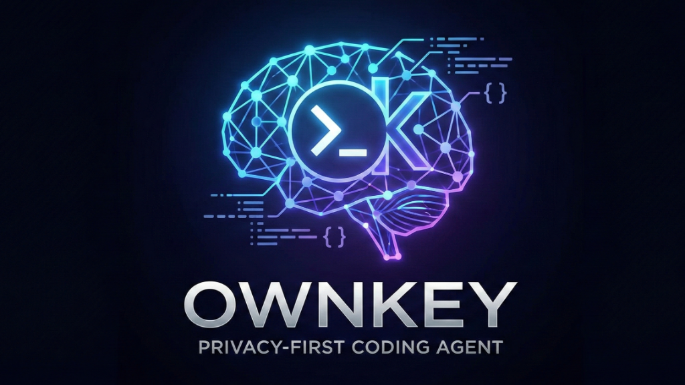

<div align="center">



# OwnKey

**Privacy-First AI Coding Agent**

[](https://www.npmjs.com/package/ownkey)
[](https://opensource.org/licenses/MIT)
[](https://www.npmjs.com/package/ownkey)

*Intelligent code analysis powered by AI • Your code never leaves your machine*

[Quick Start](#-quick-start) • [Features](#-features) • [Installation](#-installation) • [Commands](#-commands)

</div>

---

> ✨ **v0.8.0** - Now with Ollama! Run completely offline with local LLMs.

## 🚀 Quick Start

```bash
# Install
npm install -g ownkey

# Configure (choose your provider)
ownkey config

# Analyze your code
ownkey suggest .

# Apply AI suggestions (auto-fix)
ownkey apply <suggestion-id>
```

## ✨ Features

- 🤖 **4 AI Providers** - Google Gemini, OpenAI, Anthropic Claude, Ollama
- 🔒 **Privacy-First** - Your code never leaves your machine
- 🏠 **Offline Mode** - Use Ollama for 100% local analysis
- 🔧 **Auto-Fix** - Apply AI suggestions with automatic backups
- ↩️ **Rollback** - Undo any changes instantly
- 💾 **Optional Cloud Sync** - Store history in your own Supabase database
- 🔐 **Secure** - API keys stored in OS keychain or encrypted
- 📂 **Smart Scanning** - Respects .gitignore and custom patterns

## ⚡ AI Providers

<div align="center">

| Provider | Status | Best For | API Key Required |
|:--------:|:------:|:--------:|:----------------:|
| **🟢 Google Gemini** | ✅ Available | Fast & accurate | [Get Key](https://aistudio.google.com/app/apikey) |
| **🔵 OpenAI** | ✅ Available | GPT models | [Get Key](https://platform.openai.com/api-keys) |
| **🟣 Anthropic Claude** | ✅ Available | Advanced reasoning | [Get Key](https://console.anthropic.com/) |
| **🟠 Ollama** | ✅ Available | Offline & free | [Install Ollama](https://ollama.ai) |

</div>

## 🛠 Installation

```bash
npm install -g ownkey
```

## 📖 Commands

### `ownkey config`

Configure AI provider and database (optional).

```bash
ownkey config                    # Interactive wizard
ownkey config --provider gemini  # Set provider
ownkey config --reset            # Reset to defaults
```

### `ownkey scan [path]`

Scan a project directory.

```bash
ownkey scan .                    # Scan current directory
ownkey scan ./src                # Scan specific folder
```

### `ownkey suggest [path]`

Generate AI-powered code suggestions.

```bash
ownkey suggest .                 # Analyze current directory
ownkey suggest --local-only      # Skip database storage
ownkey suggest --max-files 20    # Limit files analyzed
```

### `ownkey apply <suggestion-id>`

Apply an AI-generated suggestion with automatic backup.

```bash
ownkey apply abc123              # Interactive mode
ownkey apply abc123 --auto       # Auto-apply
ownkey apply abc123 --dry-run    # Preview only
```

### `ownkey undo [backup-id]`

Undo a previously applied suggestion.

```bash
ownkey undo                      # Interactive - choose from list
ownkey undo abc123               # Undo specific backup
ownkey undo --list               # List recent applies
```

## 🟠 Using Ollama (Offline Mode)

Run OwnKey completely offline with local LLMs!

### Setup

1. **Install Ollama**
   - Windows: Download from [ollama.ai](https://ollama.ai)
   - macOS: `brew install ollama`
   - Linux: `curl https://ollama.ai/install.sh | sh`

2. **Pull a Model**
   ```bash
   ollama pull deepseek-coder  # Recommended for code
   # OR
   ollama pull codellama       # Alternative
   ```

3. **Configure OwnKey**
   ```bash
   ownkey config --provider ollama
   ```

4. **Use Offline**
   ```bash
   ownkey suggest .  # Works without internet!
   ```

### Recommended Models

- **deepseek-coder** - Best for code analysis
- **codellama** - Meta's code model
- **llama3** - General purpose
- **qwen-coder** - Alibaba's code model

## 🔐 Security

- API keys stored in OS keychain (macOS/Linux) or encrypted (Windows)
- Code never sent to cloud (except when using cloud providers)
- Ollama runs 100% locally
- Optional database (your own Supabase instance)

## 📊 What OwnKey Detects

- 🐛 **Bugs** - Logic errors, off-by-one errors, null pointers
- 🔒 **Security** - SQL injection, XSS, insecure dependencies
- ⚡ **Performance** - Inefficient algorithms, memory leaks
- ✅ **Tests** - Missing test coverage
- 📝 **Documentation** - Missing comments, unclear code
- 🎨 **Style** - Code quality improvements

## 🌐 Database (Optional)

OwnKey can store analysis history in your own Supabase database.

```bash
ownkey config --supabase-url YOUR_URL --supabase-key YOUR_KEY
```

Or run in local-only mode:

```bash
ownkey suggest . --local-only
```

## 🤝 Contributing

Contributions welcome! Please read our contributing guidelines.

## 📄 License

MIT License - see LICENSE file for details

## 🔗 Links

- [Documentation](https://ownkey.dev) *(coming soon)*
- [GitHub](https://github.com/ArpitK24/OwnKey)
- [npm](https://www.npmjs.com/package/ownkey)
- [Issues](https://github.com/ArpitK24/OwnKey/issues)

---

<div align="center">

Made with ❤️ by the OwnKey team

**Privacy-first • AI-powered • Developer-friendly**

</div>
